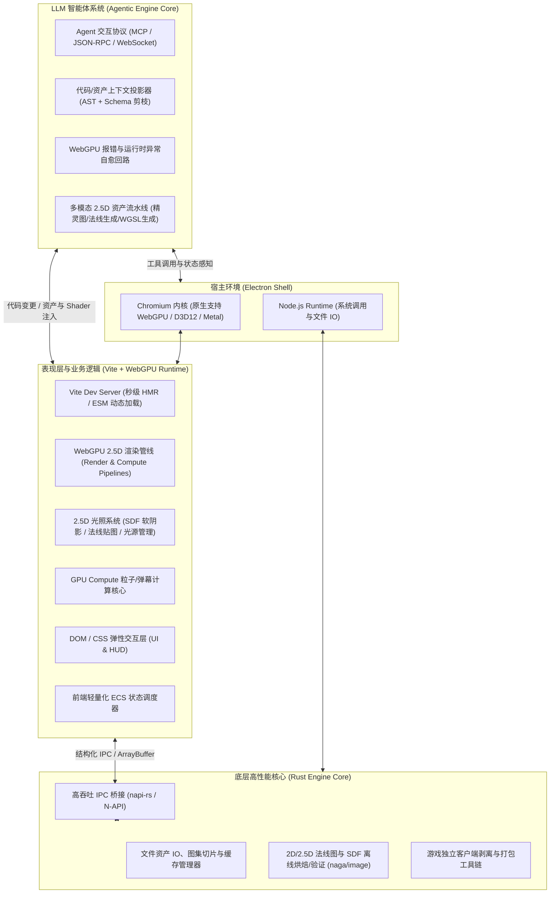
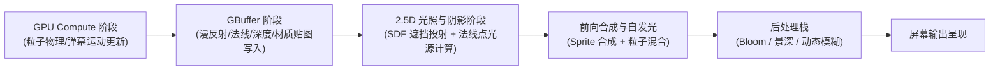

# freeEngine 架构设计文档 (ArcDesign.md)

> **版本**：v0.2.0-draft  
> **初始定位**：基于 **WebGPU** 底层渲染、深度适配大模型工作流（LLM-Native）、自举自演化（Self-Bootstrapping）的 **2.5D 游戏引擎**（即：**阴影动效极致丰富的次世代 2D 游戏**）及其开发环境。

---

## 1. 核心理念与技术愿景 (Core Philosophy & Vision)

### 1.1 前端即游戏 (Frontend IS the Game)
传统游戏引擎（如 Unity、Unreal）将 Web/前端技术仅作为 UI 挂件或轻量脚本，导致重资产、高编译开销以及开发循环冗长。  
`freeEngine` 秉承 **“前端即游戏”** 的哲学：
- **Web 技术即原生游戏运行时**：Chromium / WebGPU / Web Audio / DOM 是图形与逻辑的直接呈现载体。
- **瞬时热重载（Instant HMR）**：依托现代前端构建工具（Vite），业务逻辑、着色器、界面与交互实现毫秒级即时热替换，消除传统引擎冗长的 C++ / C# 编译与烘焙等待。
- **现代化生态开箱即用**：海量前端 NPM 库、CSS 弹性排版、三维数学库直接接入游戏主干。

### 1.2 阶段聚焦愿景：WebGPU 驱动的 2.5D 次世代表现力
受限于当前 WebGPU 的规范演进周期以及 3D 重工业资产链路（高精建模、复杂骨骼绑定、物理材质）对大模型自动化生成的过高门槛，`freeEngine` 在初始阶段**坚定聚焦于 2.5D 游戏赛道**：
- **什么是这里的 2.5D？**：
  本质上是**“阴影与动效极致丰富的 2D 游戏”**（视觉对标《八方旅人》、《空洞骑士》、《勇敢的哈克》等兼具 2D 精致绘制与次世代光影质感的高品质作品）。
- **释放 WebGPU 杀手级能力**：
  1. **实时 2.5D 动态光照与法线阴影**：通过 WebGPU 片段着色器实现多点光源漫反射、法线贴图（Normal Map）高光、高度图（Heightmap）自遮挡投影。
  2. **基于 2D SDF / 光线步进的柔和阴影**：摆脱传统 2D 贴图的扁平感，实现像素级障碍物实时投射软阴影与体积光（God Rays）。
  3. **Compute Shader 驱动的海量粒子与动效**：利用 WebGPU 计算着色器，在 GPU 端并行更新数十万个粒子（魔法弹幕、风雪雨滴、火焰气浪），零 CPU 负载。
  4. **工业级后处理栈 (Post-Processing)**：全屏泛光 (Bloom)、景深、径向模糊、色彩分级 (LUT) 与热浪扰动。

### 1.3 面向大模型架构 (LLM-Native Engine Architecture)
`freeEngine` 不是一个“在传统引擎旁挂一个 AI 聊天插件”的过渡产物，而是**自底向上为大模型（LLM/Multi-Modal Agents）协作设计**的引擎：
- **为什么 2.5D 与大模型是天作之合**：
  2D 精灵切片、帧动画、法线贴图、WGSL 着色器脚本、关卡瓦片图（Tilemap）均是多模态大模型（Diffusion + LLM）能够**高可靠性生成与自主组装**的资产形态。
- **语义化与类型自描述契约**：所有的引擎 API、组件（Components）、系统（Systems）、配置资产（Assets）均提供完备且紧凑的 TypeScript 类型定义与自描述 JSON Schema，消除大语言模型的幻觉风险。
- **自愈与自我修正循环 (Self-Healing Loop)**：运行时异常、WebGPU 验证错误（`GPUValidationError`）、类型不匹配均通过结构化日志与上下文捕获，反向推送给 LLM 进行自纠错与代码重构。

### 1.4 自举哲学：IDE 即首个 2.5D 游戏 (Bootstrapping: IDE as Game #0)
- 整个 `freeEngine IDE` 本身**就是基于 freeEngine 体系构建的“第 0 号游戏”**。
- 编辑器中的场景视口、网格标尺、粒子调优器、节点材质编辑器，全部使用引擎自身的 2.5D 渲染管线与前端 Web 组件复合构建。
- **吃自己的狗粮（Dogfooding）**：当 LLM 为 IDE 增加新功能时，其使用的语法、组件规范和接口与制作游戏完全一致。引擎的自我进化与游戏产出共享同一套心智模型。

---

## 2. 总体技术栈与系统架构 (Architecture Overview)

系统分为三层体系：**宿主层 (Host Layer)**、**原生计算与加速核心 (Native Rust Core)**、**前端游戏与呈现层 (Vite & Web Core)**。



### 2.1 技术选型明细

| 层次 | 技术选型 | 作用说明 |
| :--- | :--- | :--- |
| **应用宿主** | Electron (Chromium + Node.js) | 跨平台桌面外壳，提供无边框窗口、原生 GPU 硬件直通与本地系统调用。 |
| **构建与热更** | Vite + TypeScript + Rollup | 极致的 HMR 体验，支持 TypeScript 逻辑与 WGSL 着色器模块的即时热更新。 |
| **底层核心** | Rust (via napi-rs) | 高性能密集型任务：图集自动切片、SDF 场预烘焙、资源加密解密与独立客户端打包。 |
| **底层图形** | **WebGPU (WGSL)** | 原生接入 D3D12/Metal/Vulkan。负责 2.5D 精灵批量渲染、SDF 阴影计算与 Compute 粒子计算。 |
| **UI 与交互** | HTML5 / CSS3 / Web Components | 承载复杂 HUD、对话框系统，以及 IDE 自身的全部控制面板与浮动窗口。 |
| **Agent 接口** | Model Context Protocol (MCP) | 暴露工程上下文查询、组件编写、Shader 调试与资产注入的标准 Agent 协议。 |

---

## 3. WebGPU 2.5D 核心渲染管线设计 (WebGPU 2.5D Pipeline)

为了实现“阴影动效极致丰富的 2D 游戏”，WebGPU 管线划分为以下关键子阶段：



### 3.1 核心着色与渲染特性
1. **多通道 2.5D 延迟/混合光照 (Deferred/Clustered 2.5D Lighting)**：
   - **Albedo & Normal Pass**：单批次绘制 2D 精灵表面颜色及对应的法线贴图（Normal Map）、高度/粗糙度贴图。
   - **Light & Shadow Pass**：在屏幕空间或瓦片空间中并行计算数十个动态点光源、聚光灯与环境光。
   - **SDF 实时软阴影**：通过障碍物边缘自动生成的距离场（Signed Distance Field），在着色器内实时追踪光线遮挡，产生真实的软边缘投射阴影。
2. **GPU 驱动的超大规模粒子计算 (Compute Particles)**：
   - 粒子结构体存储在 WebGPU `storage buffer` 中。
   - Compute Shader 逐帧并行模拟粒子的重力、风阻、生命周期与碰撞反应，随后直接传入渲染管线实例化绘制（Indirect Draw），无需回传 CPU。
3. **分层 Y-Sorting 与 2.5D 深度映射**：
   - 实体虽然为 2D 表现，但拥有虚拟的 `Z`（高度）与 `Y`（地平面深度）。
   - 深度缓冲（Depth Buffer）参与测试，确保人物走过树木、建筑遮挡时阴影能够自然打在角色身上。

---

## 4. 面向 LLM 的深度开发工作流 (LLM-Native Workflow)

### 4.1 2.5D 资产与代码的生成闭环
大模型在 2.5D 场景下拥有极高的全自动交付成功率：
1. **精灵生成**：LLM 调用图像生成工具生成基础 2D 角色/怪物/物件。
2. **法线贴图生成 (Auto Normal Map)**：通过内置算法或小模型自动为 2D 精灵推断高度与法线，赋予 3D 光照体积感。
3. **WGSL 动态特效生成**：
   - 开发者提出：“给 Boss 施法加上一个暗黑风格的紫黑色黑洞吸附与地面凹陷阴影”。
   - LLM 直接生成符合规范的 WGSL 着色器代码与配套粒子 Component，Vite 毫秒级热加载直接呈现在当前游戏画面中。

### 4.2 WebGPU 验证异常自愈闭环
- 当 LLM 生成的 WGSL 着色器语法有误或 Uniform 对齐不合规时，WebGPU 会触发精密的 `GPUValidationError`。
- 引擎错误拦截系统捕获确切的着色器行号、错误描述以及上下文，自动化反哺给 Agent：
  ```
  [Shader Compilation Failed] Line 24: no matching overload for operator + (vec3<f32>, f32)
  Context: BossAuraShader.wgsl
  ```
- Agent 自动修正为 `vec3<f32>(...) + vec3<f32>(val)` 并重新提交，完成 0 人工干预的自动化自愈。

---

## 5. 引擎自举：IDE 即首个 2.5D 游戏 (IDE as Game #0)

- **场景视口**：就是一个运行着的 2.5D 游戏场景，支持自由缩放、网格吸附、动态光源拖拽即时预览。
- **调光系统**：IDE 内的光照调整面板可直接拖拽 2.5D 光源位置，实时观察其在 2D 精灵上的法线反光与投射阴影。
- **纯 Web + WebGPU 界面**：IDE 的工具栏、时间轴动画编辑器、实体组件属性面板均使用前端技术栈与引擎内部系统协同驱动。

---

## 6. 打包与分发体系 (Packaging & Distribution)

1. **Standalone 桌面游戏 (Desktop Executable)**：
   - 剥离所有 IDE 编辑器模块，保留轻量 Electron + WebGPU 独立运行时。
   - 导出免安装或安装版 Windows (.exe) / macOS (.app) 客户端。
2. **Web/HTML5 发布包**：
   - 导出为标准静态 Web 资源，可直接部署在支持 WebGPU 的现代浏览器环境或在线游戏门户。

---

## 7. 实施演进路线 (Roadmap)

### 阶段一：基础骨架与通信体系 (Milestone 1: Scaffold & Foundation)
- [ ] 搭建 Monorepo 目录结构：
  - `apps/desktop`: Electron 主进程
  - `packages/engine-core`: 基于 TypeScript 与 WebGPU 的 2.5D ECS 运行时
  - `packages/native-core`: Rust 动态库 (napi-rs) 用于图集处理与资产打包
  - `packages/ide`: 前端 Vite 驱动的 2.5D 游戏引擎 IDE（第 0 号游戏）
- [ ] 验证 Electron 中 WebGPU 上下文初始化与多窗口渲染能力。
- [ ] 实现 Vite + WGSL 着色器文件的秒级 HMR 热更新管线。

### 阶段二：WebGPU 2.5D 核心渲染管线 (Milestone 2: 2.5D WebGPU Renderer)
- [ ] 封装 `WebGPUDeviceContext` 与管线缓存（PSO Cache）。
- [ ] 实现高效 2D 精灵批处理器（Sprite Batcher），支持动态合批与法线贴图传递。
- [ ] 实现 2.5D 点光源漫反射与法线高光管线。
- [ ] 实现 2D SDF 障碍物动态软阴影着色器。
- [ ] 实现基础 WebGPU Compute Shader 粒子演示系统。

### 阶段三：面向 LLM 的工作流与协议 (Milestone 3: LLM Integration)
- [ ] 建立标准 WGSL 材质模版库（发光、溶解、扭曲、动态水面、影子投射）。
- [ ] 构建 WebGPU 校验错误与 TypeScript 运行期自愈回路（Self-Healing）。
- [ ] 提供 MCP 协议接口，允许外部大模型 Agent 读取工程、创建组件、调整光照参数。

### 阶段四：IDE 自举与全功能编辑 (Milestone 4: Self-Hosting IDE)
- [ ] 基于本引擎组件构建场景层级树（Hierarchy）、视口编辑器（Viewport）与 2.5D 光影调优器。
- [ ] 实现实时编辑态与运行态（Play/Pause/Stop）热切换。

### 阶段五：打包与一键发布 (Milestone 5: Export & Release)
- [ ] 实现从 IDE 一键导出独立 2.5D 桌面客户端（Windows/macOS）。
- [ ] 制作并打包发布第一款由大模型驱动生成的 2.5D 动作/弹幕演示游戏。
