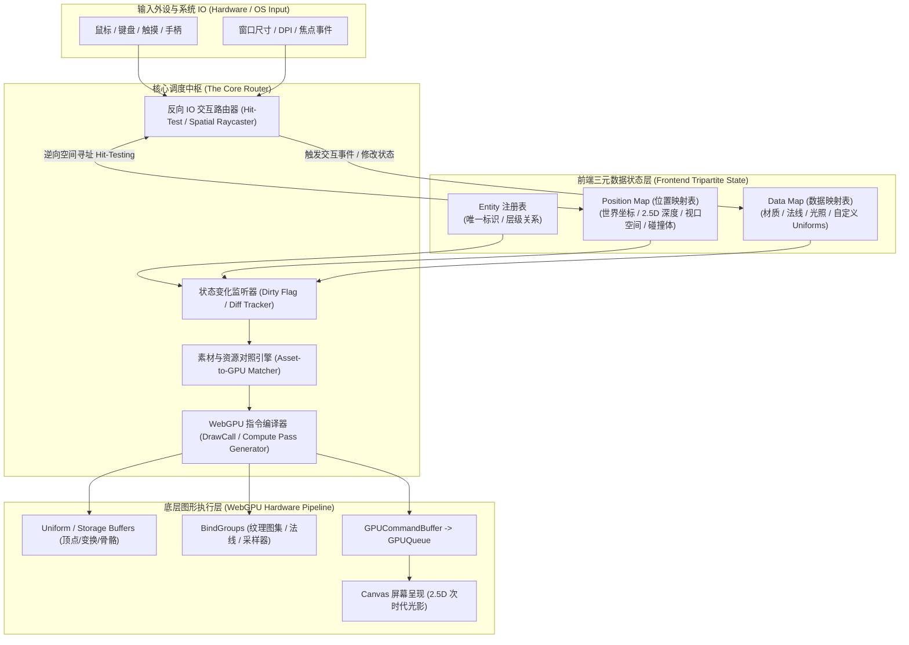
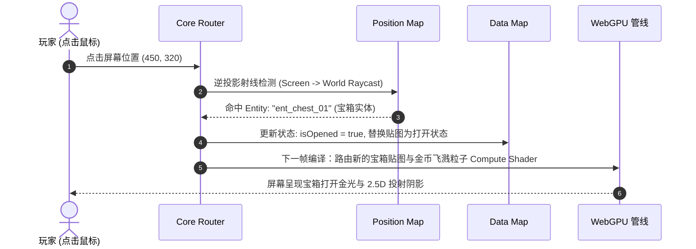
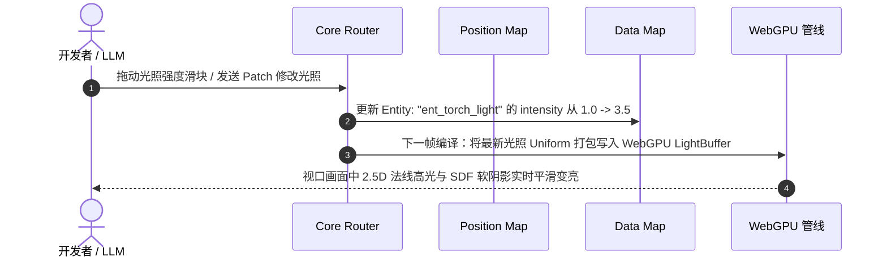

# freeEngine 核心数据流与路由器架构规范 (DataFlow.md)

> **版本**：v0.1.0-alpha  
> **核心范式**：`Entity + PositionMap + DataMap` 三元状态组装  
> **核心枢纽**：**Core Router（核心路由器）**  
> **管线职责**：  
> 1. **正向渲染流**：将前端的 Entity、位置映射与数据映射，路由并编译为 WebGPU 原生渲染/计算指令（Render & Compute Commands）。  
> 2. **反向交互流**：接收底层系统与外设 IO，经空间映射表逆向寻址对应 Entity 并驱动 DataMap 状态回写。

---

## 1. 基础数据流全局拓扑 (Architecture Topology)

整个引擎的前端显示与交互体系，彻底解耦为**“纯数据映射层”**、**“核心路由器 (Core Router)”**与**“WebGPU 硬件驱动层”**：



---

## 2. 前端三元数据映射模型 (Tripartite Data Model)

在 freeEngine 中，前端画面不是由庞大的 DOM 节点或传统的重型 Game Object 维护，而是由极简、平铺的**三元数据结构**共同界定：

### 2.1 Entity（实体标识与层级）
实体仅代表“存在性”（Existence），充当关联键：
- 唯一 ID（如 `ent_hero_01`, `ent_ide_inspector_panel`）
- 父子拓扑树（用于相对空间继承）
- 逻辑标签与分组

### 2.2 Position Map（位置空间映射表）
维护所有活跃 Entity 的空间几何与投影数据。每一帧提供给 Core Router 进行空间合批与视口裁剪：

```typescript
export interface SpatialNode {
  /** 局部坐标 (X, Y) 与 虚拟高度/深度 Z (用于 2.5D 光照与阴影) */
  local: { x: number; y: number; z: number; rotation: number; scaleX: number; scaleY: number };
  /** 计算后的世界矩阵坐标（供 GPU 直接消费） */
  world: { x: number; y: number; z: number; rotation: number; scaleX: number; scaleY: number };
  /** 2.5D 深度排序值 (Y-Sorting / Z-Index) */
  sortKey: number;
  /** 局部边界盒 (AABB) 与世界空间投影盒（用于反向 IO 点击检测与视口剔除） */
  bounds: { minX: number; minY: number; maxX: number; maxY: number };
  /** 是否在当前视口摄像机视野内 (Frustum Culling Flag) */
  inView: boolean;
}

/** 实体 ID 到空间节点的全局映射表 */
export type PositionMap = Map<string, SpatialNode>;
```

### 2.3 Data Map（数据与状态映射表）
维护所有 Entity 的视觉素材绑定、动态属性与物理参数：

```typescript
export interface VisualDataNode {
  /** 引用的素材资产 ID（漫反射纹理、法线贴图、骨骼配置） */
  textureAssetId?: string;
  normalMapAssetId?: string;
  emissionMapAssetId?: string;
  /** 材质着色参数 (颜色 Tint、粗糙度、金属度、透明度) */
  materialParams: Float32Array;
  /** 动态光照属性（若该实体是光源） */
  lightData?: {
    type: "point" | "spot" | "directional";
    color: [number, number, number];
    intensity: number;
    radius: number;
    castShadow: boolean;
  };
  /** 自定义 WGSL Uniform 字段集合 */
  customUniforms?: Record<string, number | number[]>;
  /** 动画当前帧序列信息 (Atlas Sprite UVs) */
  uvOffset: [number, number, number, number]; // [u, v, width, height]
  /** 状态脏标记：指示是否需要在当前帧重构 GPU Buffer */
  dirty: boolean;
}

/** 实体 ID 到表现/逻辑数据的全局映射表 */
export type DataMap = Map<string, VisualDataNode>;
```

---

## 3. 核心路由器 (Core Router) 深度运作机制

Core Router 是连接“前端数据域”与“WebGPU 硬件域”的唯一中枢大脑，承担两大核心任务：

```
                    ┌────────────────────────┐
                    │      Core Router       │
                    └───────────┬────────────┘
                                │
        ┌───────────────────────┴───────────────────────┐
        ▼                                               ▼
【正向渲染管道 (Render Compilation)】          【反向交互管道 (IO Dispatch)】
1. 变动监听 (Dirty Check)                       1. 接收物理输入 (Mouse/Touch/Key)
2. 空间裁剪与 Y-Sort 排序                       2. 坐标空间反向投影 (Screen -> World)
3. 实体素材 -> WebGPU 资源绑定对照               3. 查询 PositionMap 执行快速 AABB/SDF 拾取
4. 编译输出 WebGPU RenderPass / DrawCalls       4. 定位目标 Entity 并触发 DataMap 事件修改
```

### 3.1 正向渲染管道：素材对照与 WebGPU 指令编译

1. **变动收集与空间索引 (Culling & Sorting)**：
   - Router 检索 `PositionMap` 中处于当前 Camera 视口内的实体。
   - 依据 `sortKey` (结合 2.5D 深度与 Y 坐标) 对可见实体实施极速拓扑排序。
2. **素材对照与合批路由 (Asset-to-Pipeline Matcher)**：
   - Router 读取实体的 `DataMap`，根据纹理图集 ID、材质管线类型以及着色器配置，将同一材质类型的实体归入同一个渲染批次（Batch Group）。
   - 将漫反射贴图、2.5D 法线贴图、SDF 阴影图路由至对应的 WebGPU `GPUBindGroup`。
3. **数据编译为 GPU 缓冲区 (Buffer Compilation)**：
   - Router 将 `PositionMap` 的世界坐标、旋转与深度，与 `DataMap` 的 UV、颜色 Tint、光照参数序列化打入紧凑的连续浮点数缓冲区（Storage Buffer / Instanced Vertex Buffer）。
4. **编译生成 WebGPU 渲染指令 (Command Recording)**：
   - Router 直接生成 WebGPU 的 `GPURenderPassEncoder` 指令流：
     ```typescript
     // Router 编译伪代码示例
     passEncoder.setPipeline(sprite25DPipeline);
     passEncoder.setBindGroup(0, globalFrameBindGroup); // 相机与全局光照
     passEncoder.setBindGroup(1, batch.materialBindGroup); // 纹理与法线
     passEncoder.setVertexBuffer(0, batch.instanceBuffer); // 位置与属性数据
     passEncoder.draw(6, batch.instanceCount, 0, 0); // 批量绘制
     ```
   - 针对粒子与物理，Router 在渲染前先行编译并调度 `GPUComputePassEncoder` 完成 GPU 端位移模拟。

### 3.2 反向交互管道：接收 IO 并驱动全局交互闭环

Core Router 同时作为系统的**统一 IO 调度总线**：
1. **外设事件捕获**：
   - 拦截 Electron 窗口的 `pointerdown`, `pointermove`, `wheel`, `keydown` 等基础事件。
2. **空间逆向投射 (Inverse Spatial Projection)**：
   - 将屏幕像素坐标 $(X_{screen}, Y_{screen})$ 结合当前活动的 Camera 逆矩阵，转换为游戏世界的 2.5D 坐标 $(X_{world}, Y_{world}, Z_{world})$。
3. **空间碰撞与拾取 (Hit-Testing via PositionMap)**：
   - Router 遍历 `PositionMap` 中的 `bounds` 树（基于空间哈希或四叉树加速），从最上层（Top-most Sort Order）实体逐级探测命中。
4. **事件派发与 DataMap 回写**：
   - 命中实体后，Router 触发该实体的事件监听器，直接更新其在 `DataMap` 中的属性（如：高亮选中态、开启/关闭光源、修改生命值）。
   - 一旦 `DataMap` 发生更新，打上 `dirty` 标记，自动驱动下一次渲染帧的重新路由与编译。

---

## 4. 同构实战对照：游戏世界 vs IDE 界面

此套数据流的优雅之处在于：**无论是游戏关卡还是 IDE 本身，底层数据流 100% 是一模一样的！**

### 4.1 场景 A：在 2.5D 游戏中点击拾取宝箱


### 4.2 场景 B：在 IDE 中拖拽调整光照属性


---

## 5. 面向 LLM 的数据流透明性优势

1. **极致清晰的修改入口**：
   - 大模型想要改变物体位置？只需对 `PositionMap` 发送坐标更新；
   - 大模型想要改变物体外观或光影？只需对 `DataMap` 发送数据更新；
   - 大模型完全无需操心 WebGPU 的底层纹理绑定、管线切换与 Draw Call 优化，所有的转换脏活全部由 `Core Router` 全自动编译完成。
2. **自愈调试能力**：
   - 若 WebGPU 报错（如顶点 Buffer 越界或材质未绑定），Core Router 能够精确定位到是哪一个 `Entity`、哪一项 `DataMap` 映射引发的异常，从而为大模型提供零歧义的自愈上下文。
