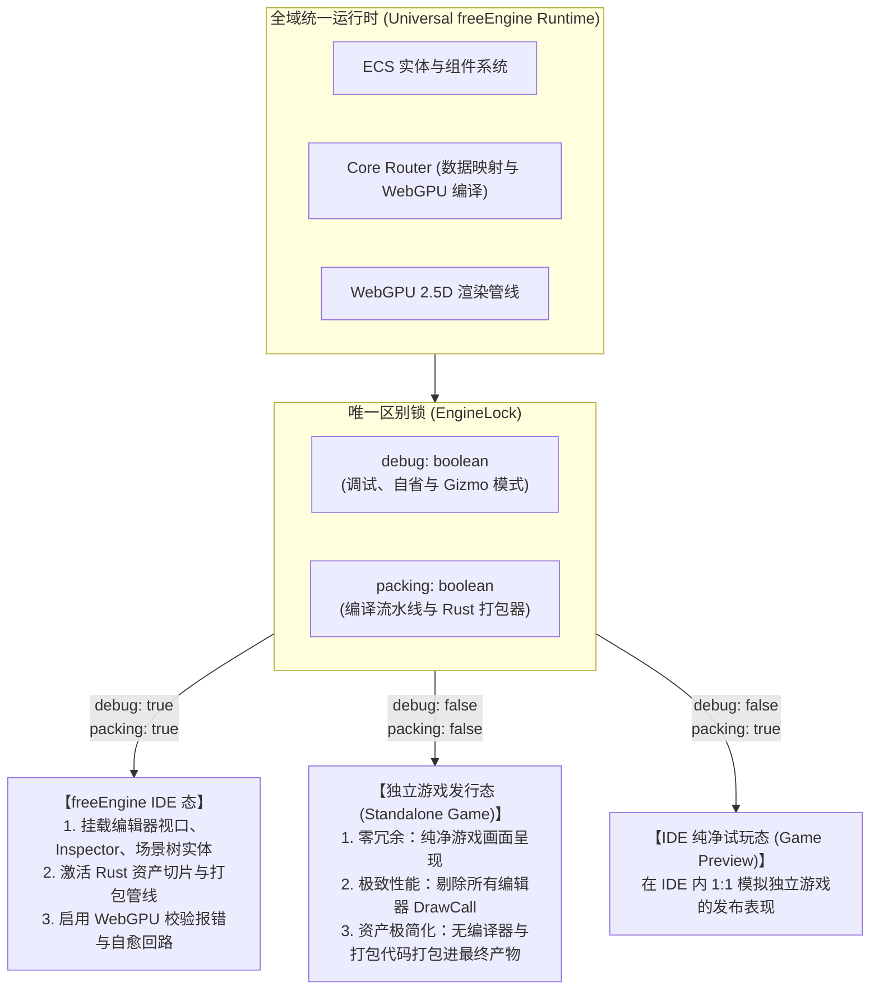
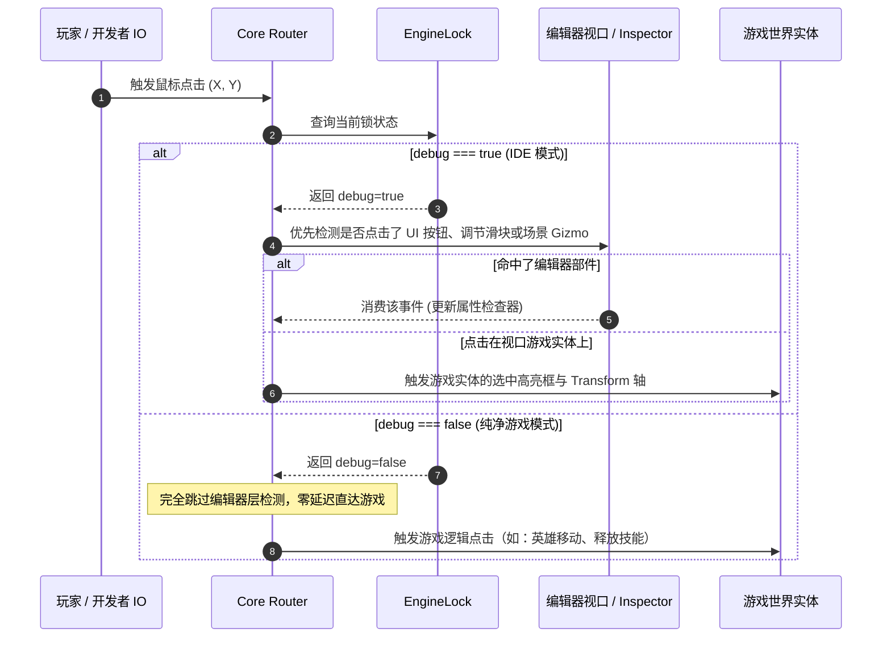

# freeEngine 运行模式锁规范 (EngineLock.md)

> **版本**：v0.1.0-alpha  
> **核心公理（The Single-Differentiator Axiom）**：  
> `freeEngine`（IDE 自身）与其产出的游戏在核心架构、组件模型与运行时上 **100% 同构**。两者之间的唯一物理与逻辑分水岭，即由本规范定义的**双键锁闸机制（The Dual Lock）**：
> $$\text{freeEngine (IDE)} = \text{Game Runtime} + \{\, \text{debug: true},\; \text{packing: true} \,\}$$
> $$\text{Released Game} = \text{Game Runtime} + \{\, \text{debug: false},\; \text{packing: false} \,\}$$

---

## 1. 设计动机与设计哲学

传统游戏引擎（如 Unity、Godot、Unreal）将“编辑器”与“播放器（Player）”割裂为两套截然不同的系统，导致：
1. 编辑器与游戏运行时维护两套通信管道与代码规范；
2. 大模型在协助开发时需要适应两套心智模型（“怎么写游戏脚本” vs “怎么扩展引擎插件”）；
3. 难以实现真正意义上的所见即所得与运行时即时热修改。

`freeEngine` 彻底推翻该壁垒：**IDE 就是一个开启了特定权限锁的游戏**。
通过统一的 `EngineLock`，引擎运行时能够根据这两个开关的状态，决定系统的模块装配、Core Router 的路由规则以及打包发布时的代码裁剪。



---

## 2. 模式锁数据契约 (`EngineLockContract`)

### 2.1 运行时锁接口定义
在 `packages/engine-core` 中，该配置作为全局单例运行期上下文暴露：

```typescript
export interface EngineLockConfig {
  /**
   * 调试与自省开关 (Debug & Introspection)
   * 
   * 当 debug === true:
   * - 挂载编辑态实体：Gizmo 轴向操纵器、网格标尺、碰撞包围盒 (AABB) 视效
   * - 激活反向自省系统：Inspector 面板对场景中选中实体的数据双向反射
   * - 拦截 WebGPU 校验错误 (GPUValidationError)，并格式化为 Agent 自愈 Prompt
   * - 启用场景快速拾取与框选路由 (Raycast Selection)
   * 
   * 当 debug === false:
   * - 彻底隐藏并跳过所有编辑态专用实体的计算与渲染
   * - IO 输入完全直达游戏世界实体，不再被编辑器层拦截
   * - 关闭昂贵的运行期边界盒检测与调试辅助渲染
   */
  debug: boolean;

  /**
   * 打包与构建工具链开关 (Packaging & Toolchain)
   * 
   * 当 packing === true:
   * - 挂载 Rust 原生模块 (napi-rs) 的离线编译与图集打包接口
   * - 允许调用 Vite Rollup 打包器构建独立游戏 Client
   * - 启用资产元数据分析、未引用资产清洗与压缩服务
   * 
   * 当 packing === false:
   * - 彻底剥离打包器模块，防止任何打包逻辑侵入游戏客户端
   * - 运行时保持只读或本地存档写权限，禁止任意重构工程文件结构
   */
  packing: boolean;
}
```

### 2.2 静态编译期与动态运行期的双层锁实现

为了确保导出的独立游戏具有**零体积浪费**与**零运行期开销**，`EngineLock` 采用**“静态编译剪枝 + 动态热切换”**双轨设计：

```typescript
// packages/engine-core/src/lock/EngineLock.ts

/** 静态环境变量注入（由 Vite 构建时 Tree-Shaking 消费） */
export const COMPILE_TIME_LOCK = {
  IS_DEBUG_BUILD: import.meta.env.VITE_FREE_DEBUG !== "false",
  IS_PACKING_BUILD: import.meta.env.VITE_FREE_PACKING !== "false",
};

export class EngineLock {
  private static _instance: EngineLock;
  private _debug: boolean;
  private _packing: boolean;

  private constructor() {
    // 默认从环境变量或工程配置中恢复
    this._debug = COMPILE_TIME_LOCK.IS_DEBUG_BUILD;
    this._packing = COMPILE_TIME_LOCK.IS_PACKING_BUILD;
  }

  public static get current(): EngineLock {
    if (!this._instance) {
      this._instance = new EngineLock();
    }
    return this._instance;
  }

  public get debug(): boolean {
    return this._debug;
  }

  public get packing(): boolean {
    return this._packing;
  }

  /**
   * 在 IDE 内部快速在“编辑态”与“1:1 游戏试玩态”之间无缝切换
   */
  public setMode(mode: { debug?: boolean; packing?: boolean }): void {
    if (mode.debug !== undefined) this._debug = mode.debug;
    if (mode.packing !== undefined) this._packing = mode.packing;
    
    // 通知 Core Router 与 ECS 系统根据新的锁状态重置管线
    EngineEvents.emit("lock:changed", { debug: this._debug, packing: this._packing });
  }
}
```

---

## 3. Core Router 对 Lock 的感知与路由截流

核心路由器（Core Router）根据 `EngineLock` 执行极其精准的路径截流：



### 3.1 渲染管线剔除（Render Culling via Lock）
当 `debug === false` 时：
1. **剔除专用 Tag 实体**：所有带有 `Tag: "EditorOnly"`、`Tag: "Gizmo"` 的 Entity，Core Router 在生成 `PositionMap` 和绘制批次时直接跳过；
2. **剔除调试着色阶段**：不执行包围盒线框渲染、光源范围线圈（Light Range Wireframe）、NavMesh 调试视效。

---

## 4. 构建与发布时的摇树裁剪 (Tree-Shaking & Exporting)

当用户或 LLM 发起“打包独立游戏”指令时，Rust 与 Vite 协同流水线将介入：

1. **打包器配置锁定**：
   - 将 `VITE_FREE_DEBUG=false` 与 `VITE_FREE_PACKING=false` 注入构建环境变量；
2. **代码级 Dead-Code Elimination (DCE)**：
   - Rollup / ESBuild 探测到：
     ```typescript
     if (COMPILE_TIME_LOCK.IS_PACKING_BUILD) {
       // 此处的 Rust Exporter、工程管理、素材编译工具代码被彻底物理删除！
     }
     if (COMPILE_TIME_LOCK.IS_DEBUG_BUILD) {
       // 此处的 Inspector 面板、场景树视图、Gizmo 绘制系统被彻底物理删除！
     }
     ```
3. **输出纯净二进制制品**：
   - 导出的桌面游戏客户端仅包含微内核级别的运行库与渲染管线，启动速度提升数倍，内存占用从 IDE 的数百兆极速收敛至几十兆。

---

## 5. 总结

`EngineLock (debug & packing)` 是 `freeEngine` 践行 **“前端即游戏”** 与 **“自举（Self-Hosting）”** 哲学的终极基石：
- 避免了“写一个编辑器，再写一个游戏引擎”的双倍劳动；
- 使整个系统保持优雅的单一真理源（Single Source of Truth）；
- 让大模型只需理解一套数据结构与逻辑编写范式，即可同时胜任“做游戏”与“改引擎”。
