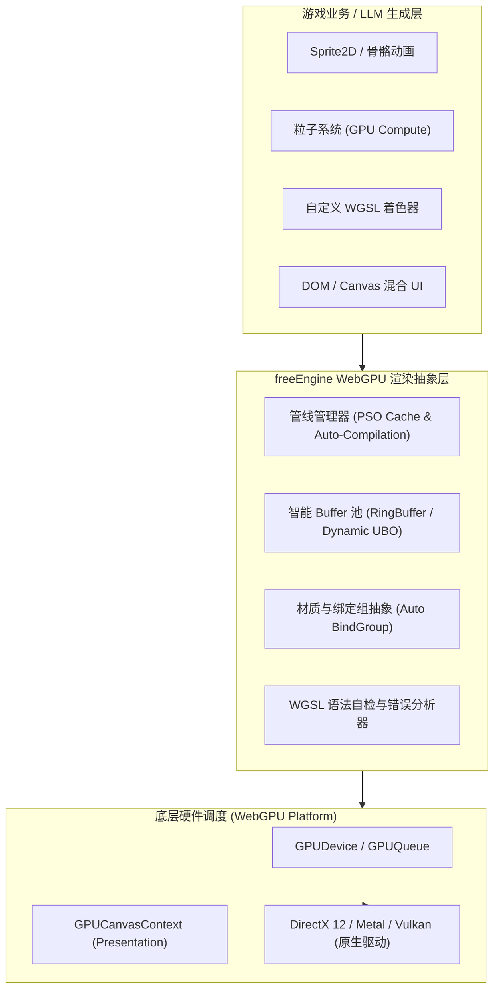

# freeEngine 底层渲染引擎选型技术评估报告：全面接入 WebGPU 可行性分析

> **报告编写日期**：2026-09-22  
> **评估主题**：基于 Electron + Chromium 内核的自举游戏引擎与 LLM 工作流体系，是否可行且适合采用 **WebGPU** 作为底层渲染引擎？  
> **核心结论**：**强烈推荐且完全可行**。WebGPU 是目前构建现代前端/Web 游戏引擎的最优选择，尤其在架构先进性、计算管线（Compute Shader）、LLM 代码生成友好度以及与 Rust 生态协同上具有无可替代的战略优势。

---

## 目录
1. [执行摘要 (Executive Summary)](#1-执行摘要-executive-summary)
2. [环境与运行时支持评估 (Electron & Chromium Support)](#2-环境与运行时支持评估-electron--chromium-support)
3. [核心技术优势深度分析 (Key Technical Advantages)](#3-核心技术优势深度分析-key-technical-advantages)
4. [面向 LLM 架构的适配性评估 (LLM-Native Compatibility)](#4-面向-llm-架构的适配性评估-llm-native-compatibility)
5. [与 Rust 原生核心 (Native Core) 的协同关系](#5-与-rust-原生核心-native-core-的协同关系)
6. [潜在挑战与应对方案 (Challenges & Mitigations)](#6-潜在挑战与应对方案-challenges--mitigations)
7. [freeEngine 渲染架构落地路线设计 (Recommended Architecture)](#7-freeengine-渲染架构落地路线设计-recommended-architecture)
8. [最终评估结论与建议](#8-最终评估结论与建议)

---

## 1. 执行摘要 (Executive Summary)

传统 Web 游戏通常基于 WebGL/WebGL2 构建，但 WebGL 基于古老的 OpenGL ES 状态机模型，存在 CPU 驱动开销大、缺乏现代多线程与计算着色器（Compute Shader）支持等固有瓶颈。

随着 Chromium 对 **WebGPU**（基于 W3C / GPU for the Web 规范）的全面默认支持，Web 图形开发迎来了划时代的飞跃。WebGPU 直接对接底层现代图形 API（Windows 下的 **DirectX 12 / Vulkan**，macOS 下的 **Metal**，Linux 下的 **Vulkan**），消除了中间状态转换开销，提供了极高的渲染吞吐能力与通用 GPU 计算能力。

结合 `freeEngine` 的定位（“前端即游戏”、“面向大模型工作流”、“IDE 自举”），采用 WebGPU 作为主要渲染底层不仅技术完全成熟，更能使引擎具备以下关键壁垒：
1. **百万级实体/粒子并行计算**：利用 Compute Shader 在 GPU 端完成动画、碰撞与粒子模拟，解决 JS 单线程瓶颈。
2. **现代强类型着色器语言 (WGSL)**：语法规范自描述、强类型，极其契合 LLM 生成与静态校验。
3. **前瞻性与技术长寿性**：WebGL 已进入维护状态，WebGPU 是 Web 图形未来 10 年的核心标准。

---

## 2. 环境与运行时支持评估 (Electron & Chromium Support)

### 2.1 Electron 环境开箱即用
- **成熟版本支持**：Chromium 自 113 版本起已在 Windows (D3D12) 和 macOS (Metal) 平台默认启用 WebGPU；Electron 26+ 起即已正式支持，当前主流 Electron 版本已完全将其作为原生能力提供。
- **配置透明**：无需复杂的启动 Flag，直接通过标准的 `navigator.gpu` 异步获取适配器与设备上下文：
  ```typescript
  if (!navigator.gpu) {
    throw new Error("WebGPU is not supported in current environment.");
  }
  const adapter = await navigator.gpu.requestAdapter({ powerPreference: "high-performance" });
  const device = await adapter.requestDevice();
  ```
- **双 GPU 调度与多窗口协作**：在 Electron 主/渲染进程架构下，各个独立的 Editor 窗口与 Game 视图均能获得独占或共享的 GPU 设备上下文。

---

## 3. 核心技术优势深度分析 (Key Technical Advantages)

### 3.1 突破 CPU/JS 瓶颈：极低的驱动与状态开销
- **管线状态对象 (Pipeline State Objects, PSO)**：WebGPU 在初始化时即预先烘焙管线状态，避免 WebGL 运行时逐帧设置状态的性能抖动。
- **渲染包 (RenderBundles)**：可以将静态或高频复用的绘制指令在录制后多帧回放，在复杂场景或庞大实体数量下，Draw Call 开销较 WebGL 下降一个数量级。

### 3.2 质变能力：通用计算着色器 (Compute Shaders)
这是 WebGL 无法企及的核心杀手锏：
- **GPU 驱动的粒子与物理模拟**：大规模弹幕、流体、布料模拟甚至简单的光线追踪完全移至 Compute Shader 处理，JS 仅需下发宏观参数。
- **GPU ECS 架构可能**：在未来演进中，可将密集型 Component 数据直接存储在 GPU Storage Buffer 中，通过 Compute Pipeline 并行迭代，实现几十万实体的高帧率运算。

### 3.3 跨平台原生 API 直通
WebGPU 在各操作系统底层的后端映射：
- **Windows**：Direct3D 12 或 Vulkan
- **macOS / iOS**：Metal
- **Linux / Android**：Vulkan
这意味着通过 Electron 运行的游戏，实际获得的是近乎原生的 DX12/Metal 级别硬件调度能力。

---

## 4. 面向 LLM 架构的适配性评估 (LLM-Native Compatibility)

`freeEngine` 的核心命题是“面向大模型开发工作流”，WebGPU 在该维度上相较于 WebGL / OpenGL 有极大的优势：

| 评估维度 | WebGL (GLSL ES) | WebGPU (WGSL) | 对 LLM 的影响 |
| :--- | :--- | :--- | :--- |
| **着色器语言规范** | GLSL 变种繁多，历史包袱重，不同驱动隐式类型转换行为差异大 | **WGSL (WebGPU Shading Language)** 规范严格，语法统一定义，强类型且无隐式转换 | **极佳**。LLM 生成 WGSL 出现编译器歧义的概率大幅降低。 |
| **错误诊断与反馈** | WebGL 错误多为全局状态标记 (`getError()`)，调试繁琐，报错往往不指示确切行列 | WebGPU 具备结构化 `GPUValidationError` 与详细的编译诊断信息（含行列号和原因） | **极佳**。报错可结构化反哺给 Agent，直接触发自愈修复（Self-Healing）。 |
| **资源描述与绑定** | 动态绑定插槽，容易出现插槽冲突与状态混乱 | 显式 `BindGroupLayout` 与 `BindGroup`，接口自描述 | **良好**。虽然模板代码略长，但可通过 Schema/TS 类型完全静态约束，避免幻觉。 |

> **关键设计考量**：WebGPU 的低层 API 涉及较多的 Buffer 字节对齐、纹理格式与 BindGroup 声明。为了不浪费 LLM 的上下文窗口，引擎层必须封装出**高阶声明式渲染组件**（如 `<SpriteBatcher>`, `<Material>`, `<MeshRenderer>`），让 LLM 专注于游戏视觉与 Shader 逻辑，而将繁琐的显存管理封装在底层。

---

## 5. 与 Rust 原生核心 (Native Core) 的协同关系

在 `freeEngine` 的架构中，Rust 负责高性能计算与打包，而 WebGPU 位于 Chromium 渲染进程。两者如何高效协同？

### 5.1 共享架构心智：`wgpu` 与浏览器 WebGPU 同源
- Rust 生态中最成熟的图形基础设施即为 **`wgpu`**（Mozilla 主导，WebGPU 规范的 Rust 原生实现）。
- **统一的 Shader 资产**：编写的 WGSL 着色器既可以在前端 Chromium 中直接执行，也可以在 Rust 核心离线工具链中通过 `naga` 进行预编译、静态类型校验与二进制优化。
- **离线烘焙管线**：Rust 原生模块可使用 `naga` / `wgpu` 在本地打包阶段预先验证所有由 LLM 生成的 Shader，确保打包发布前 0 运行时错误。

### 5.2 职责边界分明，零冗余通信
- **渲染全权交由 WebGPU**：渲染循环完全在 Chromium 渲染进程的 RequestAnimationFrame 内闭环运行，避免了将大量图形顶点数据跨进程 IPC 序列化至 Rust 再渲染的无谓消耗。
- **Rust 专攻后勤**：Rust 仅负责通过 N-API 异步向前端提供解密解压后的资源流、大型物理碰撞网格烘焙，渲染绘制完全由 WebGPU 原生驱动。

---

## 6. 潜在挑战与应对方案 (Challenges & Mitigations)

### 挑战 1：低层 API 繁琐度与内存对齐
- **现象**：Uniform Buffer 遵循严格的 16 字节对齐规则（Struct Memory Layout），编写错误会导致着色器取值异常。
- **方案**：引擎提供 **`UniformBufferLayout` 自动化助手**与 TypeScript 类型注解生成器，自动计算对齐偏移，消除人工或 LLM 编写对齐代码的失误。

### 挑战 2：导出 Web / 移动端运行时的兼容性
- **现象**：若用户希望将游戏导出为纯 Web 静态网页，部分老旧手机或非最新浏览器可能未完全适配 WebGPU。
- **应对策略**：
  1. **首发聚焦高价值环境**：桌面端（Electron）拥有 100% 确定的 WebGPU 运行环境，IDE 与桌面游戏完全无忧。
  2. **分层渲染抽象 (HAL)**：在 `packages/engine-core` 中设计抽象的 `IRenderDevice` 接口，第一阶段全力实现 `WebGPURenderDevice`；第二阶段根据需要实现极简的 `WebGL2RenderDevice` 作为保底回退。

---

## 7. freeEngine 渲染架构落地路线设计 (Recommended Architecture)



### 落实计划三步走：
1. **基础设施期**：
   - 封装 `WebGPUDeviceContext`，实现标准的管线生命周期管理。
   - 封装高性能 2D 批处理器（Sprite Batcher），通过 Storage Buffer 单批次绘制数万个精灵。
2. **LLM 适配期**：
   - 编写 WGSL 诊断与反向解析模块，当 Shader 编译报错时，自动生成结构化纠错 Prompt。
   - 建立标准 Shader 材质库模版（PBR、Toon、2D 发光、热扭曲等），为 Agent 提供上下文少样本提示（Few-Shot Templates）。
3. **计算管线演进期**：
   - 引入 Compute Shader 驱动的通用粒子与碰撞系统，彻底释放游戏性能潜能。

---

## 8. 最终评估结论与建议

| 评估项目 | 评分 (满分 5 星) | 说明 |
| :--- | :---: | :--- |
| **技术先进性** | ⭐⭐⭐⭐⭐ | 未来 10 年 Web 图形与计算的行业事实标准。 |
| **Electron 兼容性** | ⭐⭐⭐⭐⭐ | 现代 Chromium 已默认开启，Windows/macOS 平台原生稳定。 |
| **运行性能表现** | ⭐⭐⭐⭐⭐ | 借助 PSO、RenderBundle 与 Compute Shader，性能远超 WebGL2。 |
| **LLM 协同度** | ⭐⭐⭐⭐⭐ | WGSL 规范标准严谨，报错信息精准，极其契合自愈与闭环生成。 |
| **工程开发复杂度** | ⭐⭐⭐⭐☆ | 略高于 WebGL，但通过良好封装的渲染抽象层可完全抵消此复杂度。 |

**决策建议**：
**完全采用 WebGPU 作为 freeEngine 的主打底层渲染引擎。**  
这一决策不仅完全可行，且将成为 freeEngine 区别于传统老旧引擎的技术制高点。
