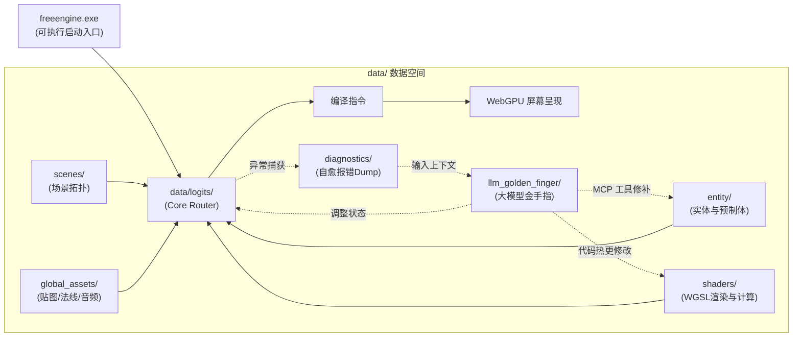

# freeEngine 脚手架与目录布局规范 (ScaffoldDesign.md)

> **版本**：v0.1.0-alpha  
> **核心定位**：极简外层运行时 + 高度数据化内层（`Data-Driven Core`）  
> **设计哲学**：运行时环境与游戏资产彻底解耦。外层为统一执行宿主，内层 `data/` 即完整承载游戏/IDE的一切逻辑、实体、Shader 与大模型智能体交互中枢。

---

## 1. 顶层目录总览 (Top-Level Topology)

```
freeEngine/
├── freeengine.exe                          # [外层宿主] 原生可执行启动入口 (调起 Electron + WebGPU，双击直接运行)
└── data/                                   # [核心数据层] 承载游戏与 IDE 全生命周期的全部资产与逻辑
    ├── Setting Book/                       # 引擎架构与设定文档集 (ArcDesign, DataStruct, etc.)
    ├── entity/                             # 渲染实体与预制体定义 (Entity & Prefabs)
    ├── scenes/                             # 场景拓扑与关卡组织 (Scene Hierarchy & Maps)
    ├── shaders/                            # 静态渲染逻辑 (WGSL Render & Compute Shaders)
    ├── logits/                             # 业务大脑 (Core Router 路由调度、ECS 系统与后端逻辑)
    ├── global_assets/                      # 全局多媒体静态资产 (纹理图集、法线图、音频、字体)
    ├── llm_golden_finger/                  # 大模型接入中枢 (MCP 契约、Prompt 模版、自愈自省入口)
    ├── profiles/                           # 运行配置 (EngineLock 状态、窗口参数、项目设置)
    ├── saves/                              # 运行期状态快照 (场景快照、存档、Undo/Redo 历史栈)
    ├── diagnostics/                        # 运行时诊断与报错 Dump (供大模型闭环读取自愈)
    └── cache/                              # 编译与显存预热缓存 (WebGPU PSO 缓存、Vite 缓存)
```

---

## 2. 现有各模块核心职责细化

### 2.1 外层宿主 (`freeengine.exe`)
- 引擎与生成游戏的唯一外层可执行启动入口（Windows 下为 `.exe`，跨平台下为对应的可执行程序）。
- 双击即可直接进入，负责调起 Electron 原生桌面宿主（启用 WebGPU 硬件加速与 Vulkan 调度），加载本地数据核心 `data/`。

### 2.2 核心数据目录 `data/`

#### (1) `entity/`（渲染实体与预制体）
- **定位**：存储所有实体的蓝图、组件原型与组合模板。
- **内容范例**：
  - `prefabs/`: 常用预制体（如 `hero_knight.prefab.json`, `wall_torch.prefab.json`）。
  - `editor_widgets/`: **自举 IDE 专用实体**（如 `inspector_panel.prefab.json`, `hierarchy_tree.prefab.json`）。
  - `components/`: 声明式组件契约与 Schema 描述文件。

#### (2) `shaders/`（静态渲染逻辑）
- **定位**：全部 WebGPU 图形管线与计算管线的着色器源文件（纯 WGSL）。
- **内容范例**：
  - `2d_lighting.wgsl`: 2.5D 法线点光源、锥形聚光灯与环境光照计算。
  - `sdf_shadow.wgsl`: 基于 2D 距离场的像素级软阴影光线步进着色器。
  - `compute_particles.wgsl`: WebGPU 计算着色器，负责大规模粒子与弹幕的 GPU 并行物理模拟。
  - `postprocess_bloom.wgsl`: 全屏泛光与色彩微调后处理管线。

#### (3) `logits/`（Router 调度中枢与后端逻辑）
- **定位**：系统的“神经中枢”与业务系统集合，负责数据映射与状态运转。
- **内容范例**：
  - `router/`: **Core Router 核心路由器**，负责 `Entity + PositionMap + DataMap` 向 WebGPU 渲染指令的编译与 IO 事件逆向路由。
  - `systems/`: 无状态的 ECS 驱动系统（如 `MovementSystem.ts`, `LightingSystem.ts`, `GizmoSystem.ts`）。
  - `native_bridge/`: 与 Rust 后端模块通信的高吞吐 IPC 调度器（处理资产切片、加密解密）。

#### (4) `global_assets/`（全局静态资源）
- **定位**：经过切片、压缩与归一化处理的多媒体二进制资源。
- **内容范例**：
  - `textures/`: 漫反射贴图 (Albedo / Diffuse)、SpriteSheet 纹理图集。
  - `normals/`: 2.5D 法线贴图（Normal Maps，赋予 2D 精灵立体受光面）。
  - `audio/`: BGM 与音效 (OGG / MP3)。
  - `fonts/`: 位图字体 (BMFont) 与矢量字体 (TTF/WOFF2)。

#### (5) `llm_golden_finger/`（大模型“金手指”控制中枢）
- **定位**：大模型 Agent 深度控制整个引擎的唯一入口与交互桥梁。
- **内容范例**：
  - `mcp_server/`: 基于 Model Context Protocol (MCP) 的标准接口服务，暴露工程操作工具（`add_entity`, `patch_shader`, `inspect_scene`）。
  - `prompts/`: 各类任务的系统提示词模板（如组件生成模板、Shader 编写规范、关卡微调指南）。
  - `schemas/`: 自动化提取的 TypeScript 类型库与 JSON Schema，每次生成时作为类型上下文喂给 LLM，确保 0 幻觉。
  - `triggers/`: 自动化监控探针（如监听代码热更失败、帧率异常突降，自动拉起 Agent 介入）。

#### (6) `profiles/`（全局配置与锁闸）
- **定位**：环境设定、权限状态与运行时配置。
- **内容范例**：
  - `engine.lock.json`: 存储当前运行模式锁（`{ "debug": true, "packing": true }` 或发版锁）。
  - `project.json`: 当前工程基础分辨率、像素模式、WebGPU 硬件偏好设定。
  - `keybindings.json`: 编辑器操作热键与游戏手柄映射配置。

#### (7) `saves/`（状态快照与历史栈）
- **定位**：运行期持久化数据与状态时光机。
- **内容范例**：
  - `game_saves/`: 游戏运行期的用户存档（角色状态、关卡进度）。
  - `editor_snapshots/`: IDE 编辑过程中自动生成的场景快照，用于高频 Undo/Redo（撤销/重做）与防止崩溃丢失。

---

## 3. 建议补充的 3 个关键目录与设计理由

在您提出的高内聚结构基础上，为保障 WebGPU 的编译效率与大模型自愈闭环的高可用性，**建议补充以下 3 个目录**：

### 建议补充 1：`scenes/`（场景与关卡拓扑）
- **为什么需要**：
  - `entity/` 负责定义**“有哪些零件（Prefab / Entity Blueprint）”**；
  - 但游戏与 IDE 都需要知道**“这些零件在某一关卡中是如何摆放、谁是谁的父节点、初始摄像机在哪、环境光照参数是多少”**；
- **目录建议**：`data/scenes/`
  - `main_ide.scene.json`: 游戏引擎 IDE 自身的初始布局场景（放置 Inspector、视口、资源栏）。
  - `level_01.scene.json`: 游戏第 1 关的场景拓扑。

### 建议补充 2：`diagnostics/`（诊断与错误 Dump 池）
- **为什么需要**：
  - 核心愿景中包含 **大模型自愈循环 (Self-Healing Loop)**；
  - 当 WebGPU 发生 `GPUValidationError`，或 Vite 编译失败、TypeScript 类型冲突时，引擎需要将结构化的错误调用栈、出问题时的 `PositionMap/DataMap` 快照写入该目录；
  - `llm_golden_finger` 直接监听或读取该目录内的 `latest_error.dump.json`，即可秒级提取上下文进行修复，实现完全自治自愈，且不污染 `saves/` 正常存档。

### 建议补充 3：`cache/`（构建与显存预热缓存）
- **为什么需要**：
  - WebGPU 编译 WGSL 生成 Pipeline State Object (PSO) 需要微秒到毫秒级开销，使用本地二进制缓存可实现“秒开视口”；
  - Rust 后端预先烘焙的 2D 距离场（SDF）与法线贴图切片临时数据需要独立存放，便于一键清理，且在 Git 中被彻底 ignore。

---

## 4. 整体数据交互关系图



---

## 5. 总结

您设计的这一套 `data/` 目录结构**极度契合“纯数据驱动”与“前端即游戏”的终极理念**：
- 结构扁平直接，对人直观，对大语言模型更是**一目了然、索引路径极短**；
- 配合补充的 `scenes/`（组织关卡）、`diagnostics/`（自愈数据源）和 `cache/`（性能缓存），整套工程架构具备了工业级的完整度与自洽性。
